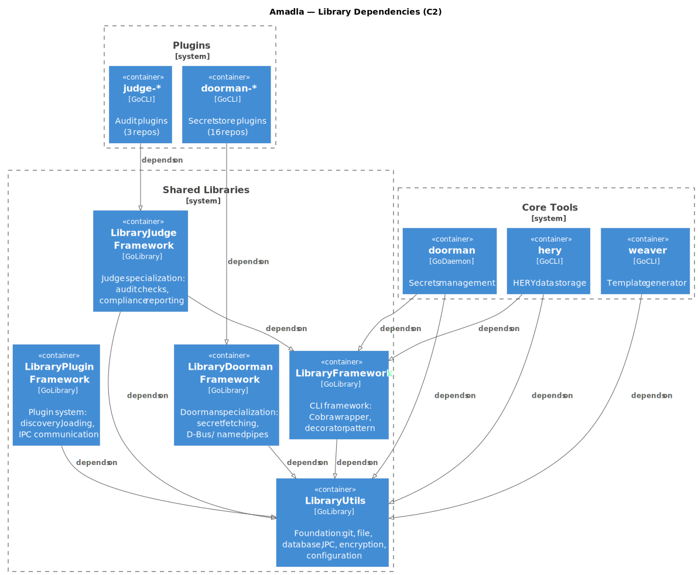

# Ecosystem Overview

The Amadla ecosystem consists of 52+ repositories organized into seven categories. All repositories live under [github.com/AmadlaOrg](https://github.com/AmadlaOrg) (public) with private services under [github.com/AmadlaCom](https://github.com/AmadlaCom).

## Repository Map

### Core Tools

CLI applications that form the data pipeline.

| Repo | Purpose |
|------|---------|
| [hery](https://github.com/AmadlaOrg/hery) | [HERY](hery-concepts.md) data storage — entity management with schema validation, Git versioning, SQLite caching |
| [doorman](https://github.com/AmadlaOrg/doorman) | Secrets management CLI — resolves secrets from Doorman plugins on demand |
| [weaver](https://github.com/AmadlaOrg/weaver) | Template generator — renders config files using HERY entities and pluggable template engines |
| [dryrun](https://github.com/AmadlaOrg/dryrun) | Safely tests settings with auto-revert (e.g., prevents SSH lockout). Currently Python, may move to Go |
| [judge](https://github.com/AmadlaOrg/judge) | Validates merged entity state — checks requirements, cross-entity conflicts, drift detection (with unravel) |
| [lay](https://github.com/AmadlaOrg/lay) | Package/app installer — installs applications based on merged entity output |
| [raise](https://github.com/AmadlaOrg/raise) | Infrastructure provisioner — provisions cloud resources from entities via plugin system per cloud API |
| [waiter](https://github.com/AmadlaOrg/waiter) | Deployment tool — blue-green, canary, rolling strategies with platform plugins |
| [unravel](https://github.com/AmadlaOrg/unravel) | Discovery tool — discovers existing system state as entities. Wraps osquery + custom plugins (stateless, on-demand) |
| [conduct](https://github.com/AmadlaOrg/conduct) | Multi-server orchestrator — coordinates waiter/lay across distributed nodes |
| [lighthouse](https://github.com/AmadlaOrg/lighthouse) | Notification/alerting tool — sends via plugins (webhook, SMS, email, REST API) |
| [garbage](https://github.com/AmadlaOrg/garbage) | Trash/uninstall tool — tracks and removes what's no longer needed |
| [enjoin](https://github.com/AmadlaOrg/enjoin) | System state configuration — users, services, cron, network, filesystem, firewall, IDS, certs, SELinux |
| [amadla](https://github.com/AmadlaOrg/amadla) | Orchestrator — reads `.hery` entities, builds DAG from `_requires`, executes tools in parallel tiers |

### Libraries

Shared Go libraries that provide common functionality.

| Repo | Purpose |
|------|---------|
| [LibraryUtils](https://github.com/AmadlaOrg/LibraryUtils) | Foundation utilities: git, file, database, IPC, encryption, configuration |
| [LibraryFramework](https://github.com/AmadlaOrg/LibraryFramework) | CLI framework wrapper around Cobra with decorator pattern |
| [LibraryPluginFramework](https://github.com/AmadlaOrg/LibraryPluginFramework) | Plugin system framework for loading and communicating with external plugins |
| [LibraryDoormanFramework](https://github.com/AmadlaOrg/LibraryDoormanFramework) | Specialization of plugin framework for Doorman (secret source) plugins |
| [LibraryJudgeFramework](https://github.com/AmadlaOrg/LibraryJudgeFramework) | Specialization of plugin framework for Judge plugins |
| [LibraryEnjoinFramework](https://github.com/AmadlaOrg/LibraryEnjoinFramework) | Specialization of plugin framework for Enjoin (system state) plugins |

### Doorman Plugins (Secret Sources)

Each plugin integrates doorman with a specific secret store.

| Repo | Integrates With |
|------|----------------|
| [doorman-vault](https://github.com/AmadlaOrg/doorman-vault) | HashiCorp Vault / OpenBao |
| [doorman-aws](https://github.com/AmadlaOrg/doorman-aws) | AWS Secrets Manager / SSM |
| [doorman-keepassxc](https://github.com/AmadlaOrg/doorman-keepassxc) | KeePassXC password manager |
| [doorman-keycloak](https://github.com/AmadlaOrg/doorman-keycloak) | Keycloak identity server |
| [doorman-bitwarden](https://github.com/AmadlaOrg/doorman-bitwarden) | Bitwarden password manager |
| [doorman-sops](https://github.com/AmadlaOrg/doorman-sops) | Mozilla SOPS encrypted files |
| [doorman-digitalocean](https://github.com/AmadlaOrg/doorman-digitalocean) | DigitalOcean secrets |
| [doorman-linode](https://github.com/AmadlaOrg/doorman-linode) | Linode/Akamai secrets |
| [doorman-vultr](https://github.com/AmadlaOrg/doorman-vultr) | Vultr secrets |
| [doorman-ovh](https://github.com/AmadlaOrg/doorman-ovh) | OVH secrets |
| [doorman-rackspace](https://github.com/AmadlaOrg/doorman-rackspace) | Rackspace secrets |
| [doorman-chrome](https://github.com/AmadlaOrg/doorman-chrome) | Chrome browser stored passwords |
| [doorman-chromium](https://github.com/AmadlaOrg/doorman-chromium) | Chromium browser stored passwords |
| [doorman-firefox](https://github.com/AmadlaOrg/doorman-firefox) | Firefox browser stored passwords |
| [doorman-thunderbird](https://github.com/AmadlaOrg/doorman-thunderbird) | Thunderbird stored credentials |
| [doorman-gnomekeyring](https://github.com/AmadlaOrg/doorman-gnomekeyring) | GNOME Keyring |

### Judge Plugins

Each plugin checks a specific aspect of system compliance.

| Repo | Validates |
|------|--------|
| [judge-application](https://github.com/AmadlaOrg/judge-application) | Whether required applications/packages are installed |
| [judge-network](https://github.com/AmadlaOrg/judge-network) | Network connectivity, DNS resolution, HTTP checks |
| [judge-system](https://github.com/AmadlaOrg/judge-system) | System-level requirements (OS, kernel, resources) |

### Weaver Plugins (Template Engines)

Each weaver plugin provides a template rendering engine.

| Repo | Engine |
|------|--------|
| [weaver-go](https://github.com/AmadlaOrg/weaver-go) | Go text/template |
| [weaver-jinja2](https://github.com/AmadlaOrg/weaver-jinja2) | Jinja2 (Python) |
| [weaver-mustache](https://github.com/AmadlaOrg/weaver-mustache) | Mustache (Go) |
| [weaver-qute](https://github.com/AmadlaOrg/weaver-qute) | Qute (Java/GraalVM native) |
| [weaver-freemarker](https://github.com/AmadlaOrg/weaver-freemarker) | FreeMarker (Java/GraalVM native) |

### Entity Definitions

JSON Schema definitions that describe the structure of HERY entities.

| Repo | Defines |
|------|---------|
| [Entity](https://github.com/AmadlaOrg/Entity) | Base HERY schema — common `_type`, `_extends`, `_meta`, `_body`, `_requires` structure |
| [Application](https://github.com/AmadlaOrg/Entities/Application) | Application requirements (packages, services, configurations) |
| [System](https://github.com/AmadlaOrg/Entities/System) | System requirements (OS, kernel, resources) |
| [Infrastructure](https://github.com/AmadlaOrg/Entities/Infrastructure) | Infrastructure requirements (servers, networks, storage) |
| [ProgrammingLanguage](https://github.com/AmadlaOrg/Entities/ProgrammingLanguage) | Programming language runtime requirements |
| [Container](https://github.com/AmadlaOrg/Entities/Container) | Container/image definitions |
| [Secret](https://github.com/AmadlaOrg/Entities/Secret) | Secret references and metadata |
| [Judge](https://github.com/AmadlaOrg/Entities/Judge) | Audit rule definitions |
| [Entities/Tools](https://github.com/AmadlaOrg/Entities) | Tool inventory and discovery configuration |

### Other Repositories

| Repo | Purpose |
|------|---------|
| [common-json-schemas](https://github.com/AmadlaOrg/common-json-schemas) | Shared JSON Schema definitions |
| [hery-playground](https://github.com/AmadlaOrg/hery-playground) | Web app for querying HERY entities (Gin + drag-drop YAML/SQLite) |
| [hery-jetbrains-editor-plugin](https://github.com/AmadlaOrg/hery-jetbrains-editor-plugin) | JetBrains IDE plugin for HERY syntax |
| [hery-code-editor-plugin](https://github.com/AmadlaOrg/hery-code-editor-plugin) | VS Code extension for HERY syntax |
| [template-application-golang](https://github.com/AmadlaOrg/template-application-golang) | Go project template with standard Makefile |
| [GitHub-Actions](https://github.com/AmadlaOrg/GitHub-Actions) | Shared CI/CD workflow templates |
| [AmadlaOrg.github.io](https://github.com/AmadlaOrg/AmadlaOrg.github.io) | GitHub Pages site |

## How Components Connect



All Go projects use `replace` directives in `go.mod` to reference sibling directories during development:

```go
replace github.com/AmadlaOrg/LibraryUtils => ../LibraryUtils
replace github.com/AmadlaOrg/LibraryFramework => ../LibraryFramework
```
