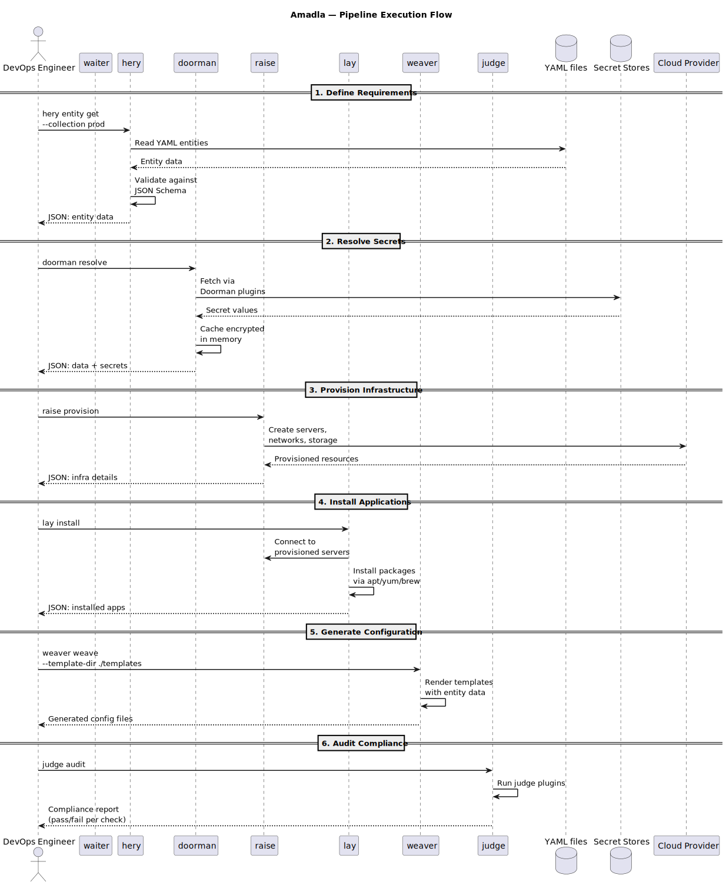

# Data Pipeline

The Amadla pipeline transforms application requirements into running, audited infrastructure. Each tool handles one stage, reading structured entity data from upstream and emitting JSON for the next stage.

## Pipeline Stages


## Stage Details

### 1. hery — Source of Truth

**Input:** YAML entity files on disk (or in Git repos)
**Output:** Structured entity data as JSON

hery reads `.hery` files that describe what an application needs. Each file is an **entity** — a versioned, schema-validated document with five reserved properties (`_type`, `_extends`, `_meta`, `_body`, `_requires`). Entity identity is derived from the git path (directory position in repo). The `_requires` property declares dependencies between entities — amadla builds a DAG and topologically sorts to determine execution order.

```bash
# Query all application entities
hery query --type '*/application@*'

# Get a specific entity
hery entity get "amadla.org/entity/application@v1.0.0"
```

Entities are cached in SQLite for fast querying. The source of truth remains the `.hery` files (optionally version-controlled via Git).

### 2. doorman — Resolve Secrets

**Input:** Entity data containing secret references
**Output:** Entity data with secrets resolved to actual values

doorman discovers `doorman-*` plugins on PATH and routes secret requests to the appropriate backend (Vault, AWS, KeePassXC, etc.). Each plugin outputs secrets in a universal entity format.

```bash
# Resolve secrets in a pipeline
hery query --type '*/application@*' -o json | doorman resolve -o json

# List available secret backends
doorman list
```

### 3. weaver — Generate Configuration

**Input:** Templates + entity data (with resolved secrets), via UNIX piping or direct cache queries
**Output:** Rendered configuration files (Quadlet, nginx.conf, podman-compose, k8s, GitHub Actions, or any text file)

weaver takes template files and fills them with data from [HERY](hery-concepts.md) entities. It supports multiple template engines via **Weaver plugins** (Jinja, Mustache, Handlebars, Qute).

```bash
# Render templates — weaver discovers template entities from hery automatically
hery query --type '*/application@*' -o json | doorman resolve -o json | weaver render

# Template entities define which engine to use and where templates live
# No --template flag needed — it's all in the entity data
```

weaver is an ETL-like tool — it can generate any text output. Config generation is weaver's job (including Quadlet unit files, nginx configs, CI/CD pipelines, etc.).

### 4. raise — Provision Infrastructure

**Input:** Infrastructure entity requirements
**Output:** Provisioned servers, networks, storage

raise reads infrastructure entity declarations and provisions the required resources. It wraps infrastructure-as-code tools via a plugin system for different providers. Available plugins: raise-libvirt (KVM/QEMU), raise-virtualbox, raise-wsl, raise-aws (EC2), raise-digitalocean, raise-quickemu, raise-opentofu (declarative IaC).

### 5. lay — Install Applications

**Input:** Application and system entity requirements
**Output:** Installed packages, applications, JARs, container images (outputs image ref entity)

lay installs required software: packages via system package managers, applications, JAR files, and container image pull/build. For containers, lay handles build and pull — waiter handles the rest.

```bash
# Install packages
lay install

# Pull container image, pipe to waiter for deployment
lay pull my-app:v2 | waiter deploy --strategy canary
```

### 6. waiter — Deploy

**Input:** Entities + rendered config files (from weaver)
**Output:** Deployed application with traffic management

waiter handles the deployment lifecycle using strategies (blue-green, canary, rolling). It consumes container image refs from lay and rendered configs from weaver.

```bash
# Full deployment pipeline
hery query --type '*/application@*' | doorman resolve | weaver render --template quadlet | waiter deploy --strategy canary

# Promote canary to full traffic
waiter promote my-app

# Rollback
waiter rollback my-app
```

### 7. judge — Validate

**Input:** Expected state (from hery) + actual state (from unravel)
**Output:** Judge entity (diff — pass/fail per requirement)

judge compares "what IS" (via unravel) vs "what SHOULD BE" (via hery entities) and outputs an judge entity — a diff in entity format. Supports both generic deep diff and type-aware judge plugins.

```bash
# Drift detection
unravel discover --type network | judge audit

# Reconciliation loop (on cron/systemd timer)
unravel discover | judge audit | lighthouse notify
```

## Supporting Tools

| Tool | Role |
|------|------|
| **unravel** | Discovers existing system state as entities. Wraps osquery (on-demand, stateless) + custom plugins |
| **conduct** | Multi-server orchestration — coordinates waiter/lay across distributed nodes |
| **lighthouse** | Notifications/alerts via plugins (webhook, SMS, email, REST API). Receives entity output from any tool |
| **dryrun** | Safely tests settings by applying them and auto-reverting if something goes wrong |
| **garbage** | Tracks what's no longer needed and handles cleanup/uninstallation |
| **amadla** | Orchestrator — reads `.hery` entities, builds DAG from `_requires`, executes tools in parallel tiers |

## Data Flow Example

The following sequence diagram shows the full pipeline execution:



A complete flow for deploying a containerized web application:

```yaml
# yaml-language-server: $schema=https://amadla.org/entity/hery/v1.0.0/schema.hery.json
---
_type: amadla.org/entity/application/webserver@v1.0.0
_meta:
  name: my-web-app
  description: Web application with TLS
_body:
  name: my-web-app
  port: 443
  network:
    ports:
      - 80
      - 443
```

```bash
# Pipeline execution
hery query --type '*/application@*' -o json \
  | doorman resolve -o json \
  | weaver render -o json \
  | waiter deploy --strategy canary --weight 5

# Validate
unravel discover | judge audit

# Promote if OK
waiter promote my-app
```

Each `|` represents a JSON entity hand-off between tools.
