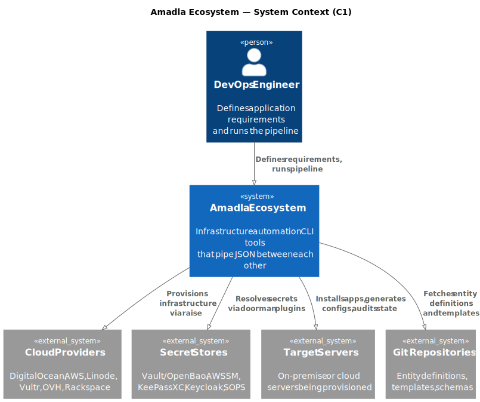

# Amadla Ecosystem

Amadla is an infrastructure automation ecosystem for setting up and managing servers — from a single laptop to a fleet of cloud instances. It works on **any OS** (Linux, macOS, Windows, OpenBSD) and follows the **UNIX philosophy**: small, focused tools that each do one thing well and can be mixed, replaced, or extended independently.

Each tool reads specific types of [HERY](architecture/hery-concepts.md) entities (structured YAML files that describe *what* you need) and figures out *how* to make it happen on the target platform. Tools communicate via stdin/stdout, piping YAML or JSON between each other.

!!! info "Core Differentiator"
    Amadla is **resource-centric**: instead of defining environments (like Terraform or Ansible), each resource (application, service, database) carries its own schema-validated configuration. Requirements are declared explicitly — not buried in documentation — and enforced by schemas. Layers compose and merge, giving a single queryable source of truth.

## The Idea: Lists and Specialists

Imagine you have a busy Saturday. You need groceries, your dog needs a vet visit, and your kid wants a custom pizza. You write three lists:

- **Grocery list** — milk, eggs, bread, avocados
- **Vet appointment** — dog name, symptoms, vaccination history
- **Pizza order** — large, extra cheese, pepperoni, no olives

Each list goes to a **specialist** who knows exactly how to read it. The grocery store reads your grocery list. The vet reads the appointment details. The pizza shop reads the pizza order. You don't explain how to stock shelves, perform surgery, or operate a pizza oven — you just describe **what you want**, and each specialist figures out the rest.

Now imagine doing this **without lists**. You walk into the grocery store and try to remember everything from memory. You forget the avocados. At the vet, you can't remember when the last vaccination was. At the pizza shop, you order the wrong size. Every stop is trial-and-error.

**That's the difference Amadla makes.** In infrastructure automation:

- **[HERY](architecture/hery-concepts.md) entities** are the lists — structured, validated, reusable descriptions of what you need
- **Tools** are the specialists — each reads specific entity types and knows how to act on them
- **The pipeline** is your Saturday route — [amadla](tools/amadla.md) looks at all your lists, figures out which specialist handles each one, and works out the right order

A package entity goes to [lay](tools/lay.md) (the installer). A template entity goes to [weaver](tools/weaver.md) (the config generator). A secret entity goes to [doorman](tools/doorman.md) (the secrets resolver). A user entity goes to [enjoin](tools/enjoin.md) (the system configurator). Each tool only understands its own entity types — and that's the point. Simple tools, clear boundaries, no confusion.

## The Pipeline



```
Define requirements (hery) → Resolve secrets (doorman) → Provision infra (raise)
    → Install apps (lay) → Configure system (enjoin) → Generate configs (weaver) → Audit state (judge)
```

Because every tool follows the same protocol (stdin/stdout, structured data, standard exit codes), you can:

- **Replace** any tool with your own implementation
- **Skip** tools you don't need
- **Add** custom tools that read new entity types
- **Pipe** tools together in any combination

## Ecosystem at a Glance

| Category | Count | Examples |
|----------|-------|---------|
| **Core Tools** | 14 | [hery](tools/hery.md), [doorman](tools/doorman.md), [weaver](tools/weaver.md), [judge](tools/judge.md), [lay](tools/lay.md), [raise](tools/raise.md), [enjoin](tools/enjoin.md), [waiter](tools/waiter.md), [unravel](tools/unravel.md), [conduct](tools/conduct.md), [lighthouse](tools/lighthouse.md), [garbage](tools/garbage.md), [dryrun](tools/dryrun.md), [amadla](tools/amadla.md) |
| **Libraries** | 6 | [LibraryUtils](libraries/library-utils.md), [LibraryFramework](libraries/library-framework.md), [LibraryPluginFramework](libraries/library-plugin-framework.md), [LibraryDoormanFramework](libraries/library-doorman-framework.md), [LibraryJudgeFramework](libraries/library-judge-framework.md), [LibraryEnjoinFramework](libraries/library-enjoin-framework.md) |
| **Doorman Plugins** | 16 | [doorman-vault, doorman-aws, doorman-keepassxc, doorman-keycloak, ...](plugins/doorman-plugins.md) |
| **Raise Plugins** | 10 | [raise-libvirt, raise-virtualbox, raise-wsl, raise-xen, ...](plugins/raise-plugins.md) |
| **Judge Plugins** | 3 | [judge-application, judge-system, judge-infrastructure](plugins/judges.md) |
| **Weaver Plugins** | 4 | [weaver-jinja, weaver-js-handlebars, weaver-js-mustache, weaver-qute](plugins/weavers.md) |
| **Enjoin Plugins** | 10 | [enjoin-user, enjoin-service, enjoin-firewall, enjoin-cron, ...](plugins/enjoin-plugins.md) |
| **Entity Definitions** | 27+ | [15 types + sub-types + Tools](entities/overview.md) |

**Total: 52+ repositories** across [AmadlaOrg](https://github.com/AmadlaOrg) (public) and [AmadlaCom](https://github.com/AmadlaCom) (private).

## Sections

- [Vision & Philosophy](vision/philosophy.md) — Application-centric approach, UNIX philosophy, pipeline model
- [Architecture](architecture/ecosystem-overview.md) — Component map, data pipeline, [HERY](architecture/hery-concepts.md) data model, plugin system
- [Tools](tools/overview.md) — Tool canvases for every CLI tool
- [Libraries](libraries/overview.md) — Shared Go libraries and dependency graph
- [Plugins](plugins/overview.md) — Raise, doorman, judge, weaver, and enjoin plugins
- [Entities](entities/overview.md) — [HERY](architecture/hery-concepts.md) entity definitions and schemas
- [Standards](standards/go-conventions.md) — Go conventions, testing, project structure, CLI patterns
- [Roadmap](roadmap/current-state.md) — Current state, gaps, development plan, dependency graph
- [Glossary](glossary/glossary.md) — Amadla-specific terminology

## Key Technologies

[HERY](architecture/hery-concepts.md) is **YAML-based**, entities are validated against **JSON Schema**, and versioning requires **Git**.
