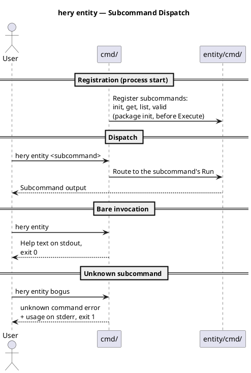
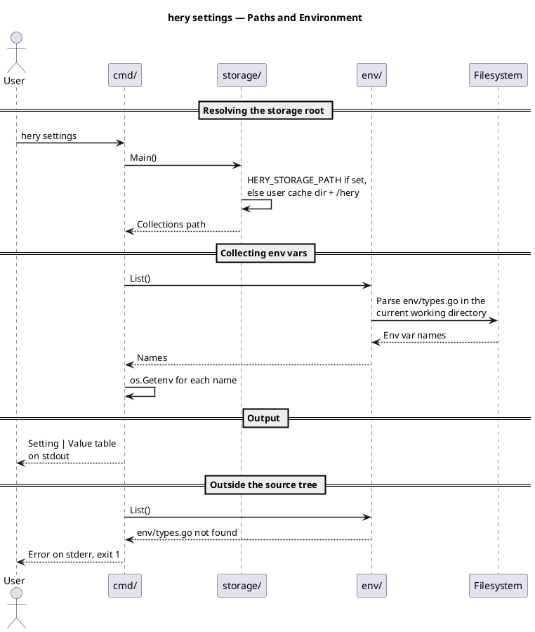
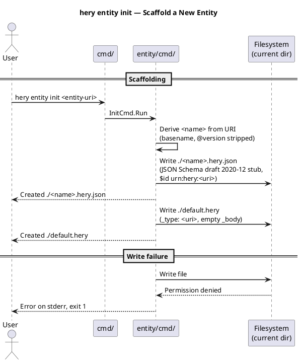
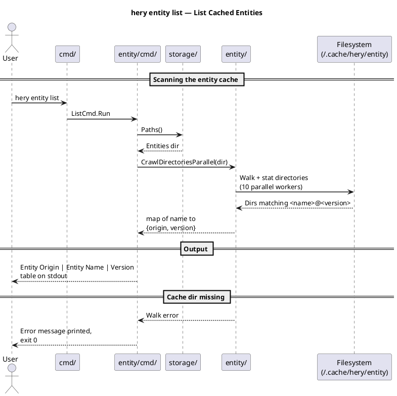
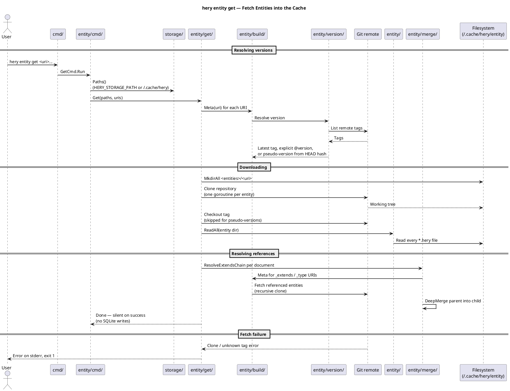
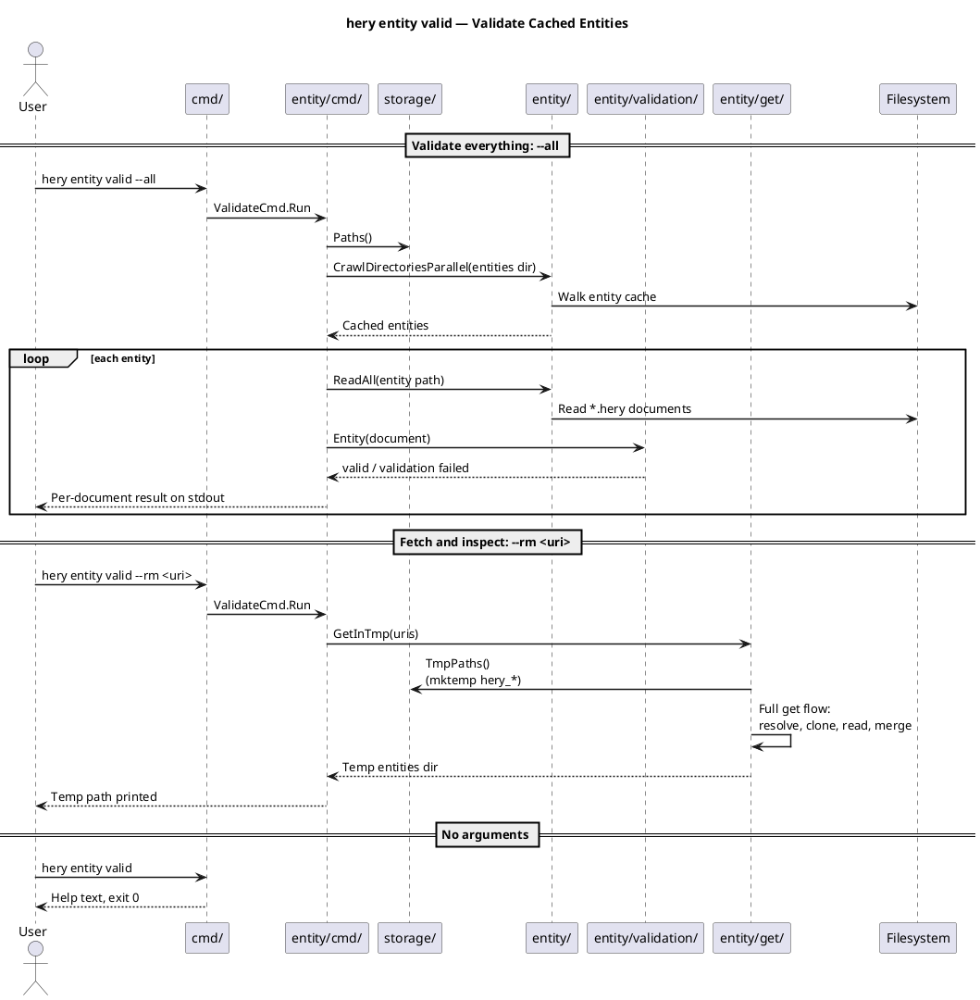
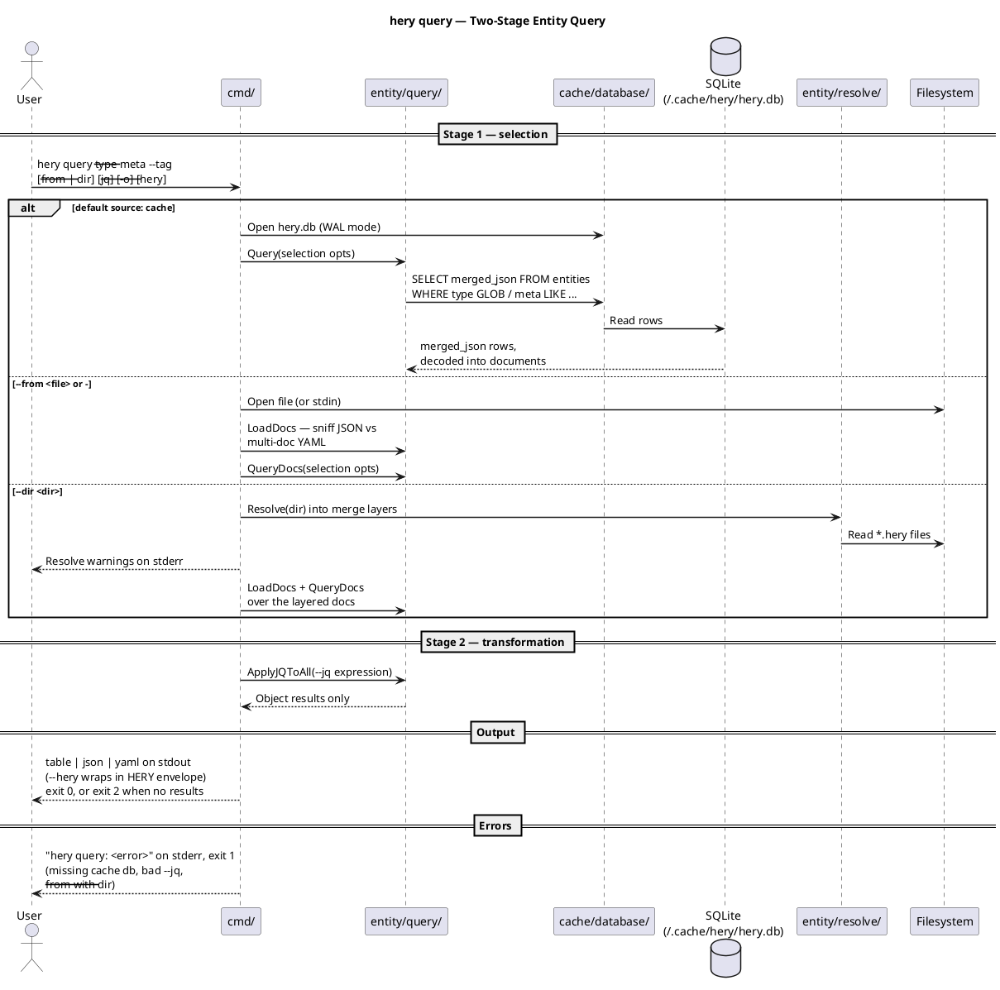
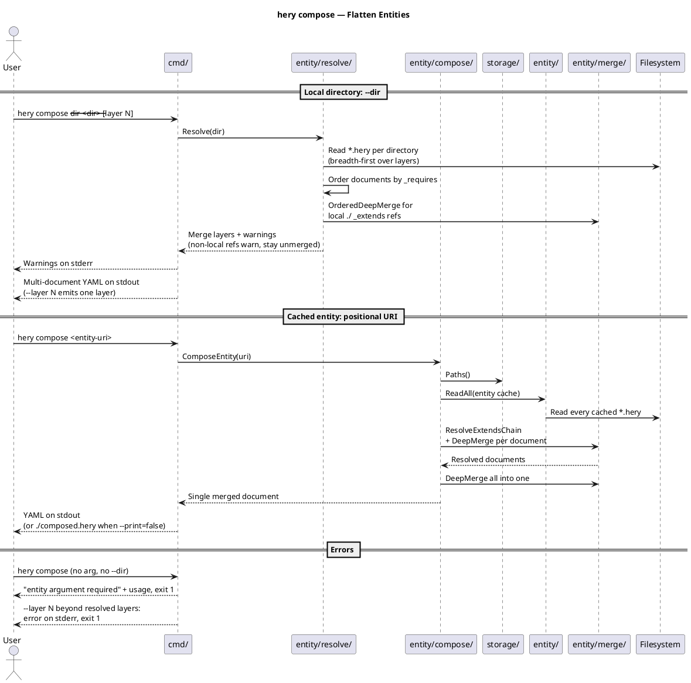

# hery Command Sequence Diagrams Implementation Plan

> **For agentic workers:** REQUIRED SUB-SKILL: Use superpowers:subagent-driven-development (recommended) or superpowers:executing-plans to implement this plan task-by-task. Steps use checkbox (`- [ ]`) syntax for tracking.

**Goal:** Add 8 PlantUML sequence diagrams (one per hery subcommand) and a new "hery Commands" docs page to AmadlaOrg.github.io.

**Architecture:** Plain PlantUML sequence sources in `docs/diagrams/src/seq-hery-*.puml`, rendered to light+dark SVG pairs by the existing `docs/diagrams/render.sh` (`make diagrams`). A new MkDocs page `docs/tools/hery-commands.md` embeds each pair with prose. Participants use the C3 component names from `c3-hery-internals.puml` so C4 zooms into C3.

**Tech Stack:** PlantUML (jar at `~/.local/plantuml/plantuml.jar`), MkDocs Material, GNU Make.

## Global Constraints

- Repo: `/home/jn/Projects/Amadla/org/AmadlaOrg.github.io`, branch `docs/hery-command-diagrams` (already exists, spec committed on it). All commands below run from the repo root unless stated.
- Git: human-only authorship, NO AI attribution trailers of any kind, commits scoped to this task only. Never commit `CLAUDE.md`, `.idea/`, `bin/`.
- Diagram style (matches `docs/diagrams/src/seq-secret-resolution.puml`): `@startuml seq-hery-<name>` header (output SVG is named after it), a `title` line, `skinparam sequenceArrowThickness 1.5`, `skinparam sequenceParticipantBorderColor #444`, `== phase ==` separators. No C4-PlantUML macros, no smetana pragma, no `cloud` elements.
- Diagrams reflect the actual hery source (verified 2026-07-26), including where it contradicts intuition: `hery entity get` does NOT write to SQLite; no CLI command populates the cache table (`hery query` only reads it); `hery settings` parses `env/types.go` from the current working directory.
- Every diagram must render without errors: `java -jar $HOME/.local/plantuml/plantuml.jar -checkonly docs/diagrams/src/<file>.puml` exits 0.
- Page images use Material light/dark pairs: `` + ``.

---

### Task 1: Dispatch + settings diagrams (the two simple ones)

**Files:**
- Create: `docs/diagrams/src/seq-hery-entity.puml`
- Create: `docs/diagrams/src/seq-hery-settings.puml`

**Interfaces:**
- Produces: SVG basenames `seq-hery-entity` and `seq-hery-settings` referenced by Task 7's page.

- [ ] **Step 1: Write `docs/diagrams/src/seq-hery-entity.puml`**



- [ ] **Step 2: Write `docs/diagrams/src/seq-hery-settings.puml`**



- [ ] **Step 3: Verify both render**

Run: `java -jar $HOME/.local/plantuml/plantuml.jar -checkonly docs/diagrams/src/seq-hery-entity.puml docs/diagrams/src/seq-hery-settings.puml && echo OK`
Expected: `OK` (exit 0, no syntax errors)

- [ ] **Step 4: Commit**

```bash
git add docs/diagrams/src/seq-hery-entity.puml docs/diagrams/src/seq-hery-settings.puml
git commit -m "Add sequence diagrams for hery entity dispatch and hery settings"
```

---

### Task 2: entity init + entity list diagrams

**Files:**
- Create: `docs/diagrams/src/seq-hery-entity-init.puml`
- Create: `docs/diagrams/src/seq-hery-entity-list.puml`

**Interfaces:**
- Produces: SVG basenames `seq-hery-entity-init` and `seq-hery-entity-list` referenced by Task 7's page.

- [ ] **Step 1: Write `docs/diagrams/src/seq-hery-entity-init.puml`**



- [ ] **Step 2: Write `docs/diagrams/src/seq-hery-entity-list.puml`**



- [ ] **Step 3: Verify both render**

Run: `java -jar $HOME/.local/plantuml/plantuml.jar -checkonly docs/diagrams/src/seq-hery-entity-init.puml docs/diagrams/src/seq-hery-entity-list.puml && echo OK`
Expected: `OK`

- [ ] **Step 4: Commit**

```bash
git add docs/diagrams/src/seq-hery-entity-init.puml docs/diagrams/src/seq-hery-entity-list.puml
git commit -m "Add sequence diagrams for hery entity init and list"
```

---

### Task 3: entity get diagram (the complex one)

**Files:**
- Create: `docs/diagrams/src/seq-hery-entity-get.puml`

**Interfaces:**
- Produces: SVG basename `seq-hery-entity-get` referenced by Task 7's page.

- [ ] **Step 1: Write `docs/diagrams/src/seq-hery-entity-get.puml`**



- [ ] **Step 2: Verify it renders**

Run: `java -jar $HOME/.local/plantuml/plantuml.jar -checkonly docs/diagrams/src/seq-hery-entity-get.puml && echo OK`
Expected: `OK`

- [ ] **Step 3: Commit**

```bash
git add docs/diagrams/src/seq-hery-entity-get.puml
git commit -m "Add sequence diagram for hery entity get"
```

---

### Task 4: entity valid diagram

**Files:**
- Create: `docs/diagrams/src/seq-hery-entity-validate.puml`

**Interfaces:**
- Produces: SVG basename `seq-hery-entity-validate` referenced by Task 7's page.

- [ ] **Step 1: Write `docs/diagrams/src/seq-hery-entity-validate.puml`**

Note: the CLI verb is `valid` (`hery entity valid`); the file keeps the spec's `validate` basename.



- [ ] **Step 2: Verify it renders**

Run: `java -jar $HOME/.local/plantuml/plantuml.jar -checkonly docs/diagrams/src/seq-hery-entity-validate.puml && echo OK`
Expected: `OK`

- [ ] **Step 3: Commit**

```bash
git add docs/diagrams/src/seq-hery-entity-validate.puml
git commit -m "Add sequence diagram for hery entity valid"
```

---

### Task 5: query diagram

**Files:**
- Create: `docs/diagrams/src/seq-hery-query.puml`

**Interfaces:**
- Produces: SVG basename `seq-hery-query` referenced by Task 7's page.

- [ ] **Step 1: Write `docs/diagrams/src/seq-hery-query.puml`**



- [ ] **Step 2: Verify it renders**

Run: `java -jar $HOME/.local/plantuml/plantuml.jar -checkonly docs/diagrams/src/seq-hery-query.puml && echo OK`
Expected: `OK`

- [ ] **Step 3: Commit**

```bash
git add docs/diagrams/src/seq-hery-query.puml
git commit -m "Add sequence diagram for hery query"
```

---

### Task 6: compose diagram

**Files:**
- Create: `docs/diagrams/src/seq-hery-compose.puml`

**Interfaces:**
- Produces: SVG basename `seq-hery-compose` referenced by Task 7's page.

- [ ] **Step 1: Write `docs/diagrams/src/seq-hery-compose.puml`**



- [ ] **Step 2: Verify it renders**

Run: `java -jar $HOME/.local/plantuml/plantuml.jar -checkonly docs/diagrams/src/seq-hery-compose.puml && echo OK`
Expected: `OK`

- [ ] **Step 3: Commit**

```bash
git add docs/diagrams/src/seq-hery-compose.puml
git commit -m "Add sequence diagram for hery compose"
```

---

### Task 7: hery Commands page, nav, cross-link, exclude_docs

**Files:**
- Create: `docs/tools/hery-commands.md`
- Modify: `mkdocs.yml` (nav entry after `hery: tools/hery.md`; add `superpowers/` to `exclude_docs`)
- Modify: `docs/tools/hery.md` (one link line in the Commands section)

**Interfaces:**
- Consumes: the 8 SVG basenames from Tasks 1-6 (`seq-hery-entity`, `seq-hery-settings`, `seq-hery-entity-init`, `seq-hery-entity-list`, `seq-hery-entity-get`, `seq-hery-entity-validate`, `seq-hery-query`, `seq-hery-compose`). The SVGs themselves are produced in Task 8; strict build happens there.

- [ ] **Step 1: Write `docs/tools/hery-commands.md`**

```markdown
# hery Commands

Sequence diagrams for each `hery` subcommand — the C4 dynamics level of the
[hery architecture](hery.md). Participants are the internal components from
the [C3 diagram](hery.md#architecture), so each diagram zooms into the same
boxes: `cmd/`, `entity/cmd/`, `entity/get/`, `entity/resolve/`,
`entity/merge/`, `entity/compose/`, `entity/query/`, `entity/validation/`,
`entity/version/`, `entity/build/`, `cache/database/`, `storage/` — plus
the externals they talk to (filesystem, Git remotes, SQLite).

## hery entity

Namespace command that groups the entity lifecycle subcommands: `init`,
`get`, `list`, and `valid`. Run bare it prints their help; an unknown
subcommand exits non-zero with usage on stderr.


## hery entity init

Scaffolds a new entity in the current directory: a starter JSON Schema
(`<name>.hery.json`, draft 2020-12, `$id` derived from the URI) and a stub
`default.hery` document carrying the `_type`. Existing files are
overwritten, so run it in a fresh directory.


## hery entity get

Fetches entities into the global cache (`HERY_STORAGE_PATH` or
`~/.cache/hery/entity`). Each URI is resolved to a concrete version from
the repository's Git tags — latest tag, an explicit `@version`, or a
generated pseudo-version when the repo has no tags — then the repo is
cloned and every `.hery` document it contains is read. References made
through `_extends` and `_type` are fetched recursively and deep-merged.
Success is silent; note that `get` populates the on-disk entity cache only,
not the SQLite database `hery query` reads.


## hery entity list

Scans the entity cache directory and prints a table of every downloaded
entity's origin, name, and version. A missing or empty cache prints a
message and exits zero — listing nothing is not an error.


## hery entity valid

Validates cached entity documents. `--all` walks the whole entity cache
and reports each document as valid or failed; `--rm <uri>` instead fetches
the named entities into a throwaway temp directory and prints its path.
Run bare it prints its help.


## hery query

The two-stage query model. Stage 1 selects entities — by default from the
SQLite cache (`~/.cache/hery/hery.db`), or from a YAML/JSON file or stdin
with `--from`, or from a resolved directory of `.hery` files with `--dir`
— filtering on `--type` (glob), `--meta`, and `--tag`. Stage 2 optionally
transforms each selected document with a `--jq` expression. Output is a
table, JSON, or YAML (`-o`), optionally wrapped in a HERY envelope with
`--hery`. Exit code 2 means the query ran but matched nothing, grep-style.


## hery compose

Flattens entities into their final form. With `--dir`, a local directory
of `.hery` files is resolved into ordered merge layers — `_requires`
ordering within a layer, local `_extends` deep-merged, non-local
references left as warnings — and emitted as a multi-document YAML stream
(`--layer N` picks one layer); this is the stream `raise up -f -`
consumes. With a positional entity URI, the cached entity's `_extends`
chain is deep-merged into a single document, printed by default or written
to `./composed.hery` with `--print=false`.


## hery settings

Prints a table of hery's resolved storage root (`HERY_STORAGE_PATH` or the
user cache dir) and the current values of hery's environment variables.


```

- [ ] **Step 2: Add the nav entry in `mkdocs.yml`**

Find (around line 61):

```yaml
      - hery: tools/hery.md
```

Change to:

```yaml
      - hery: tools/hery.md
      - hery Commands: tools/hery-commands.md
```

- [ ] **Step 3: Extend `exclude_docs` in `mkdocs.yml`**

Find:

```yaml
exclude_docs: |
  diagrams/vendor/
```

Change to:

```yaml
exclude_docs: |
  diagrams/vendor/
  superpowers/
```

- [ ] **Step 4: Link from `docs/tools/hery.md`**

At the end of the `## Commands` section (before `## Dependencies`), add:

```markdown
Per-command sequence diagrams: [hery Commands](hery-commands.md).
```

- [ ] **Step 5: Commit**

```bash
git add docs/tools/hery-commands.md docs/tools/hery.md mkdocs.yml
git commit -m "Add hery Commands page with per-command diagram sections"
```

---

### Task 8: Render, build strict, visual check, PR

**Files:**
- Create (generated): `docs/diagrams/out/seq-hery-*.svg` and `docs/diagrams/out/seq-hery-*-dark.svg` (16 files)

**Interfaces:**
- Consumes: all 8 `.puml` sources and the Task 7 page.

- [ ] **Step 1: Render all diagrams**

Run: `make diagrams`
Expected: ends with `==> done: N files in out/` and `ls docs/diagrams/out/seq-hery-*.svg | wc -l` prints 16.

- [ ] **Step 2: Strict MkDocs build**

Run: `mkdocs build --strict 2>&1 | tail -5`
Expected: build completes with no warnings/errors (strict mode aborts on any). If it fails on a missing anchor `hery.md#architecture`, check the heading id on the built hery page and fix the link in `hery-commands.md`.

- [ ] **Step 3: Visual check of one pair**

Open `docs/diagrams/out/seq-hery-query.svg` and `seq-hery-query-dark.svg` (send them to the user or view in browser). Confirm: title renders, participants labeled, dark variant uses the dark palette.

- [ ] **Step 4: Commit rendered SVGs**

```bash
git add docs/diagrams/out/seq-hery-*.svg
git commit -m "Render hery command sequence diagrams (light + dark)"
```

- [ ] **Step 5: Push and open PR**

```bash
git push -u origin docs/hery-command-diagrams
gh pr create --title "Add per-command sequence diagrams for hery" --body "..."
```

PR body must summarize the change and list the spec-vs-code corrections (no AI attribution): `entity get` writes only the on-disk cache, never SQLite; no CLI command populates the SQLite `entities` table (`query` reads it only); `settings` reads `env/types.go` from the cwd, so it fails outside the source tree; the validate verb is `valid`; `entity/schema/` is constructed but never invoked at runtime, so it appears in no diagram.

---

## Self-Review Notes

- Spec coverage: 8 diagrams (Tasks 1-6), page + nav + link + exclude_docs (Task 7), render + strict build + visual check + PR (Task 8). All spec sections covered.
- Code-truth corrections applied: no SQLite writes in `entity get` (spec sketch said otherwise — PR body notes it); `entity/schema/` omitted from participants (never called at runtime); `env/` added as a participant in the settings diagram (real package, not in C3 — noted in PR body); list's missing-cache lane exits 0, not non-zero.
- Type consistency: SVG basenames in Task 7's page match the `@startuml` names in Tasks 1-6 exactly (`seq-hery-entity`, `seq-hery-entity-init`, `seq-hery-entity-get`, `seq-hery-entity-list`, `seq-hery-entity-validate`, `seq-hery-query`, `seq-hery-compose`, `seq-hery-settings`).
