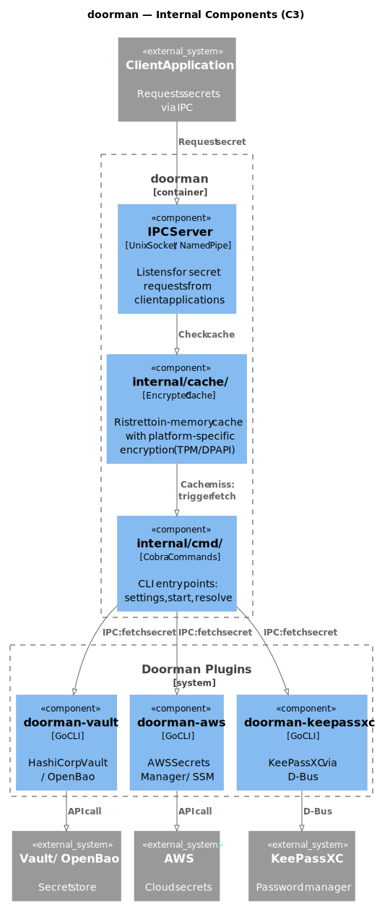

# doorman

| Field | Value |
|-------|-------|
| **Purpose** | Secrets management — discovers `doorman-*` plugins on PATH and provides a unified interface for retrieving secrets from any backend |
| **Repo** | [AmadlaOrg/doorman](https://github.com/AmadlaOrg/doorman) |

## Commands

| Command | Status | Description |
|---------|--------|-------------|
| `doorman settings` | Working | Manage doorman configuration |
| `doorman resolve` | Planned | Resolve secret references in entity data (pipes to stdout) |
| `doorman list` | Planned | List discovered `doorman-*` plugins and their supported entities |
| `doorman get` | Planned | Retrieve a secret via the appropriate plugin |

## Dependencies

| Library | Purpose |
|---------|---------|
| LibraryUtils | Configuration, file operations |
| LibraryFramework | CLI framework (Cobra wrapper) |
| LibraryPluginFramework | Plugin discovery (PATH scanning for `doorman-*`) |

## Pipeline Position

doorman sits **between hery and raise** in the pipeline. It receives entity data containing secret references and resolves them to actual values before passing data downstream.

```
hery → [doorman] → raise → lay → weaver → judge
         │
    ┌────┴────────┐
    │ Doorman     │
    │ Plugins     │
    │ (vault,     │
    │  aws, ...)  │
    └─────────────┘
```

## Architecture



### Core Flow

```
Entity with secret refs → doorman → doorman-* plugin (via stdin/stdout) → Secret entity (universal format) → stdout
```

doorman is a **wrapper tool**, not a daemon. It discovers `doorman-*` plugins on PATH, routes entity data to the appropriate plugin based on entity type support, and outputs secrets in a universal entity format.

### Package Structure

```
main.go                 # CLI entry via LibraryFramework
internal/
├── cache/              # In-memory cache with platform-specific encryption
│   └── cache.go        # Ristretto cache + encryption wrapper
└── cmd/                # CLI subcommands
    └── settings.go     # Settings command implementation
```

## Current Gaps

- Only `settings` command is functional
- Plugin discovery (PATH scanning for `doorman-*`) not yet implemented
- `resolve`, `list`, and `get` commands not yet implemented
- Legacy daemon/IPC code needs removal (replaced by UNIX stdin/stdout protocol)
- No tests beyond basic structure

## Key Files

| Path | Purpose |
|------|---------|
| `main.go` | CLI entry point |
| `internal/cache/cache.go` | Encrypted in-memory cache implementation |
| `internal/cmd/settings.go` | Settings command |
| `go.mod` | Dependencies and local replace directives |
