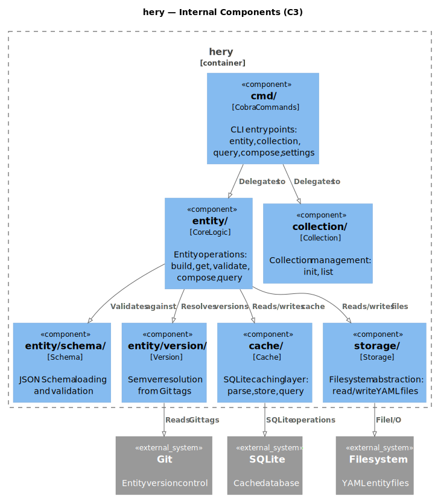

# hery

| Field | Value |
|-------|-------|
| **Purpose** | HERY (Hierarchical Entity Relational YAML) data storage with schema validation, Git versioning, and SQLite caching |
| **Repo** | [AmadlaOrg/hery](https://github.com/AmadlaOrg/hery) |

## Commands

| Command | Status | Description |
|---------|--------|-------------|
| `hery entity get` | Working | Retrieve a specific entity |
| `hery entity list` | Working | List entities |
| `hery entity validate` | Working | Validate entity content against JSON Schema |
| `hery query` | Working | Query entities with selection flags + jq transformation |
| `hery compose` | Working | Compose multiple entities into a unified view |
| `hery settings` | Working | Manage hery configuration |

## Dependencies

| Library | Purpose |
|---------|---------|
| LibraryUtils | Git operations, file system, database, configuration |
| LibraryFramework | CLI framework (Cobra wrapper) |

## Pipeline Position

hery is the **first stage** in the Amadla pipeline. It reads YAML entity files from disk (or Git repos), validates them, caches them in SQLite, and outputs structured JSON for downstream tools.

```
YAML files → [hery] → JSON entity data → doorman → ...
```

No tool feeds into hery — it is the data source.

## Architecture



### Package Structure

```
cmd/                    # Cobra CLI commands
├── entity.go           # hery entity (get, list, validate)
├── query.go            # hery query
├── compose.go          # hery compose
└── settings.go         # hery settings

entity/                 # Core entity logic
├── build/              # Entity building from YAML
├── cmd/                # Entity subcommand implementations
├── compose/            # Multi-entity composition
├── get/                # Entity retrieval
├── merge/              # Deep merge engine
├── query/              # Query engine (selection flags + gojq)
├── schema/             # JSON Schema handling
├── validation/         # Entity validation against schema
└── version/            # Semver version resolution

cache/                  # SQLite caching layer
├── database/           # SQLite operations
└── parser/             # Cache parsing
storage/                # Filesystem abstraction
message/                # Error types
```

### Key Design Decisions

- **Dual storage:** YAML files (source of truth) + SQLite (fast queries)
- **Git-based versioning:** Entity URIs include version tags resolved from Git
- **JSON Schema validation:** Every entity type has a schema; validation is enforced
- **Deep merge:** Objects merge recursively, arrays replace, scalars use child value
- **URI resolution:** Go-module-style resolution for `_type` and `_extends` URIs
- **Two-stage query:** Selection flags (SQLite-indexed) + jq transformation (gojq compiled in)
- **Comment-aware YAML:** Uses goccy/go-yaml to preserve `$schema` comments
- **Interface-based design:** `Entity`, `Storage`, `Cache` — all mockable (idiomatic Go naming, no I/S prefix)
- **BDD testing:** Uses Ginkgo v2 + Gomega (unlike most Amadla projects which use testify)

## Current Gaps

- Add `_requires` as 5th reserved property (Draft 3.5)
- `_requires` syntax validation at parse time (URI format, `../` escape prevention)
- Cache rebuild from source YAML may have edge cases
- URI resolution (Go-module-style, meta tag discovery) not yet implemented
- Documentation within the project is sparse

## Key Files

| Path | Purpose |
|------|---------|
| `cmd/entity.go` | Entity command registration and flag setup |
| `cmd/query.go` | Query command entry point |
| `entity/entity.go` | Core `Entity` interface and implementation |
| `entity/merge/` | Deep merge engine |
| `entity/query/` | Two-stage query (selection + gojq) |
| `cache/database/` | SQLite schema and operations |
| `entity/schema/` | JSON Schema loading and validation |
| `entity/version/` | Semver resolution from Git tags |
| `.mockery.yaml` | Mock generation configuration |
| `.schema/` | Internal schema definitions |
| `resources/sql/` | SQL resource files |
