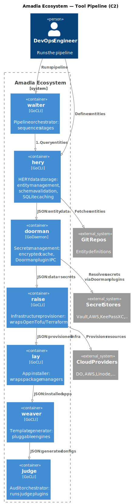

# Vision & Philosophy

## The Problem: Configuration is Far from the Resource

Traditional IaC tools (Terraform, Ansible, Puppet) are **environment-centric**: settings live near the environment, not near the resource. A developer deploying an application must hunt through documentation, do trial and error, and hope they don't forget a critical requirement. When something fails, generic errors from Linux or cloud providers give little indication of what's actually missing.

Requirements are often given in documentation format — or not at all. The knowledge of "what does this application need to run?" is scattered across READMEs, wiki pages, and tribal knowledge.

## The Solution: Resource-Centric Configuration

Amadla inverts this. It is **resource-centric**: each resource (application, service, database) carries its own configuration as a schema-validated [HERY](../architecture/hery-concepts.md) entity. Requirements are **declared explicitly** — not buried in docs — and enforced by schemas.

### Example

**Environment-centric (Ansible):**
```yaml
- hosts: webservers
  tasks:
    - apt: name=nginx state=present
    - template: src=nginx.conf.j2 dest=/etc/nginx/nginx.conf
    - service: name=nginx state=started
```

You must know that this app needs nginx, where the config goes, and how to start it. This knowledge is baked into the playbook. Forget a requirement? You'll find out at deploy time.

**Resource-centric (Amadla):**
```yaml
# yaml-language-server: $schema=https://amadla.org/entity/hery/v1.0.0/schema.hery.json
---
_type: amadla.org/entity/application@v1.0.0
_requires:
  - amadla.org/entity/application/db/rdbms@^v1.0.0
_meta:
  name: my-web-app
_body:
  name: my-web-app
  port: 80
```

The resource declares its own requirements and dependencies. The schema enforces them. `_requires` declares what must be processed first — amadla builds a dependency graph (DAG) and topologically sorts execution order. Tools downstream (raise, lay, weaver, waiter, judge) read these declarations and act accordingly.

## Layered Composition

Resources don't exist in isolation. A system has multiple applications, each with its own HERY configuration. The OS has its own. The cloud service has its own. HERY merges them — think of it as layers:

```
Cloud/Infra layer    ← Infrastructure (AWS, DigitalOcean, bare metal...)
  └─ OS layer        ← System (Ubuntu, NixOS...)
    └─ App layer     ← Application (nginx, postgres...)
      └─ Override    ← User's site-specific HERY
```

Each layer can override or extend the layers below it. The directory path determines whether a value is overridden (same path = deep merge) or added (different path = accumulate). The merged result is the source of truth, but every individual layer is preserved and queryable.

## UNIX Philosophy

Amadla follows the UNIX philosophy:

1. **Each tool does one thing well.** `hery` manages data, `doorman` manages secrets, `weaver` generates templates, `waiter` deploys, `judge` validates — they don't overlap.

2. **Tools communicate via standard I/O.** Data flows through stdin/stdout as JSON or YAML. Diagnostics go to stderr. No shared databases, no message queues, no RPC — just pipes.

3. **Small, composable programs.** You can use any tool independently, or chain them together in a pipeline.

4. **Text (structured data) as the universal interface.** YAML in, JSON out. Every tool speaks the same entity format.

5. **No caching by default.** Tools like unravel discover and output — the user caches if they want. Data flows through pipes, not shared state.

## The Pipeline Model

The Amadla pipeline flows from requirements to running infrastructure:



| Stage | Tool | Input | Output |
|-------|------|-------|--------|
| **Define** | hery | `.hery` entity files | Merged entity JSON |
| **Resolve secrets** | doorman | Entity data with secret refs | Entity data with resolved secrets |
| **Generate config** | weaver | Templates + entity data | Config files (Quadlet, nginx.conf, etc.) |
| **Provision** | raise | Infrastructure entities | Provisioned servers/resources |
| **Install** | lay | Application entities | Installed software + image ref entity |
| **Deploy** | waiter | Entities + configs | Deployed application |
| **Validate** | judge | Expected + actual entities | Judge entity (diff) |

### Supporting Tools

| Tool | Role |
|------|------|
| **unravel** | Discovers existing system state as entities (wraps osquery, stateless) |
| **conduct** | Multi-server orchestration (coordinates waiter/lay across nodes) |
| **lighthouse** | Notifications/alerts via plugins (webhook, SMS, email, REST API) |
| **dryrun** | Safely tests settings with auto-revert (prevents SSH lockout, etc.) |
| **garbage** | Tracks and removes what's no longer needed |
| **amadla** | Meta-tool: executes Pipeline entities, generates D2 diagrams, tool inventory |

## Encouraged Infrastructure

- **Podman** (rootless, Quadlet) — single-server container management via systemd
- **HAProxy** — load balancing and traffic management
- **systemd** — restarts failed containers on a single server
- **conduct** — coordinates across servers when scaling beyond one

## Extensibility Through Plugins

Each tool that interfaces with external systems uses a **plugin architecture**:

- **doorman-*** plugins extend doorman with new secret sources (Vault, AWS, KeePassXC, Keycloak, ...)
- **judge-*** plugins extend judge with new validation targets (applications, systems, infrastructure)
- **weaver-*** plugins extend weaver with new template engines (Jinja, Mustache, Handlebars, Qute)
- **raise-*** plugins extend raise with VM and cloud providers (libvirt, VirtualBox, AWS, Hetzner, OpenTofu)
- **waiter-*** plugins extend waiter with deployment backends (Podman, Docker, systemd)
- **lighthouse-*** plugins extend lighthouse with notification channels (webhook, SMS, email, REST)
- **unravel-*** plugins extend unravel with custom discovery backends

Plugins are standalone CLI executables discovered via `$PATH` using a `<tool>-*` naming convention (e.g., `doorman-vault`, `judge-application`, `weaver-jinja`). They communicate via stdin/stdout/stderr following a standard protocol — no IPC, no daemons. Plugins can be written in any language. Go framework libraries are available as optional convenience wrappers to reduce boilerplate.

## Pipeline Entities and the amadla Meta-Tool

For complex workflows, pipelines can be defined as HERY entities (`amadla.org/entity/Pipeline@v1.0.0`). The **amadla** meta-tool reads these entities and orchestrates tool execution. It can also generate D2 diagrams for visual debugging.

Pipeline entities are **data** (like GitHub Actions YAML or podman-compose), not executable code. The amadla tool is written in Go but is **replaceable** — the pipeline entities are the portable part. Anyone can read a Pipeline entity and orchestrate the tools their own way.
